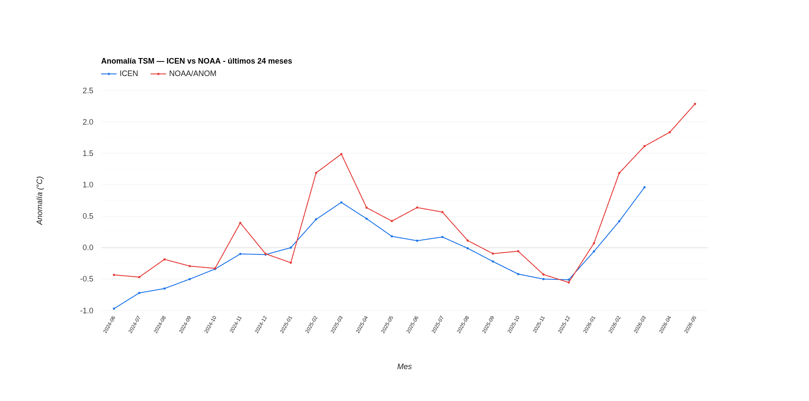
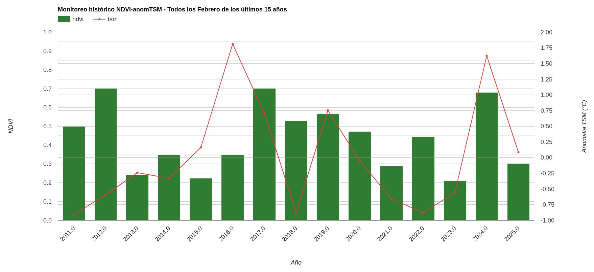
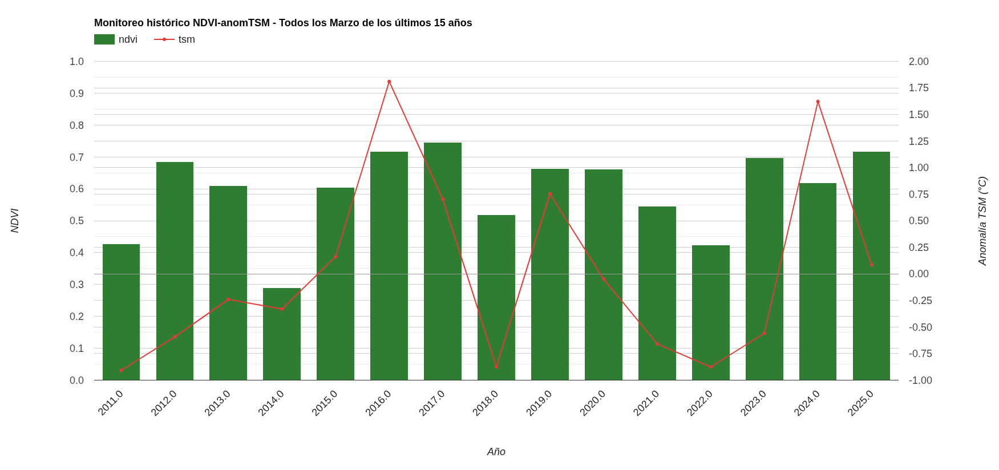
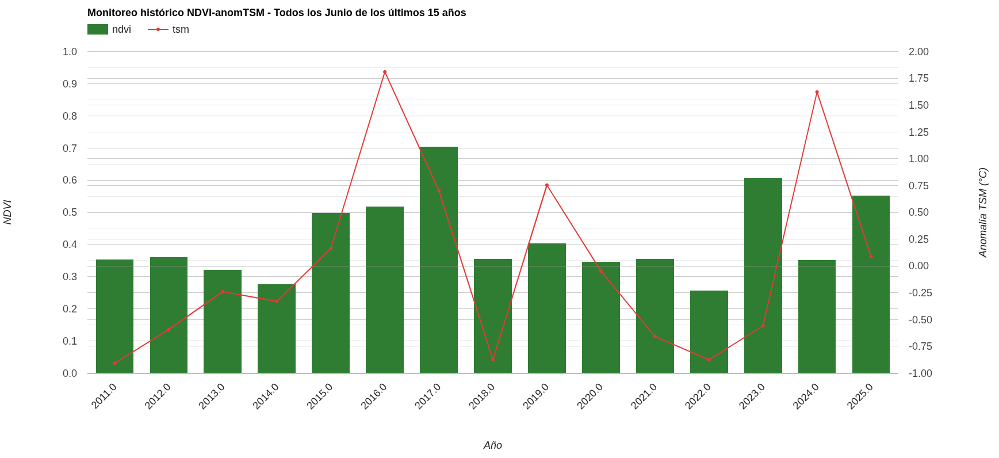
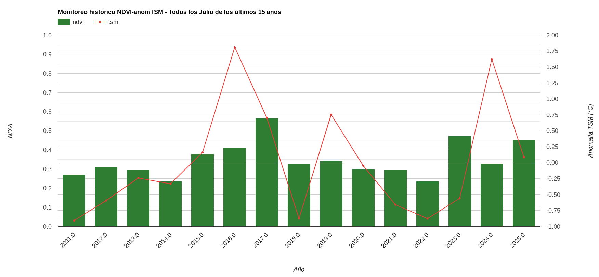
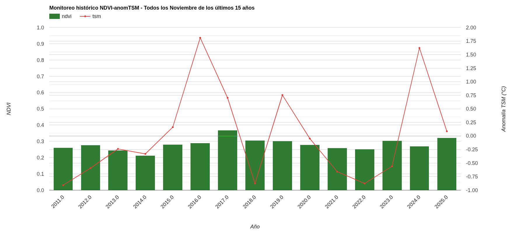
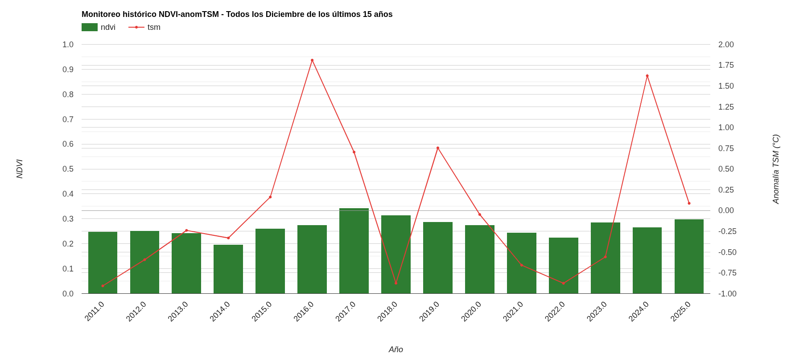
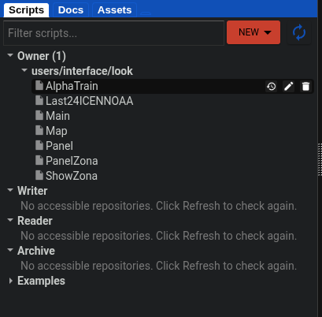

# Nota de datos actualizados a junio de 2026

## 1. Incremento constante de TSM zona 1+2 ENSO

Según el monitoreo de la anomalía de la temeperatura superficial del mal generado en la aplicación, se observa tanto en el dataset de ICEN (truncado hasta marzo) y en NOAA (actualizado diariamente) la tendencia al incremento de esta anomalía aunciando de esta forma un nuevo evento El Niño lo que concuerda con los anuncios oficiales.

Fue en el último marzo que se rompió el record del año pasado, justamente a partir de tal mes el año pasado la anomalía fue aminorando hasta volver a valores estándar entre egosto y octubre, sin embargo, a partir del marzo pasado no sucedió así si no que como se puede ver siguió subindo a razón de 0.4°C grados cada más hasta esta úmtima semana que llega a 2.86°C.

## 2. Valor del monitoreo de NDVI-TSM histórico y comportamiento fenológico observado

El monitoreo de meses anteriores es útil porque permite comparar la dinámica histórica con el comportamiento reciente del suelo agrícola en la ventana temporal de 15 años y compoararla con las anomalías de TSM medias de los 6 meses anteriores ofreciendo de esta forma una herramienta fácil de usar, accesible, gratuita y basada en datos para la agricultura de presición.

En ese sentido, en el análisis de dicha gráfica puede obervarse el ciclo fenológico de una determinada zona en relación a la anomalía de TSM, integrando también aquellos eventos climáticos extremos que se hayan registrado durante tal periodo.

Dejo el caso del distrito de La Cruz en la provincia de Tumbes del departamento del mismo nombre, donde encontré con más claridad lo mencionado:

 

> Febrero - Marzo

 
> Junio - Julio

 

> Noviembre - Diciembre

## Notas técnicas breves

- **Anomalía TSM:** La señal debe interpretarse como tendencia de incremento, no como valor absoluto. El valor actual de 2.86°C es significativo en el contexto histórico.

- **Modelo de clasificación:** A futuro es importante actualizar las etiquetas de entrenamiento del modelo de clasificación para evitar el sesgo de área geográfica con muestras de otras latitudes y altitudes.

- **App:** La nueva versión de la aplicación ofrece mejoras no solo en la interfaz y método de clasificación si no la implemetación de una estructura modular en su código lo que permite una mantenibilidad y escalabilidad mejoradas.

Dejo captura de ello:

